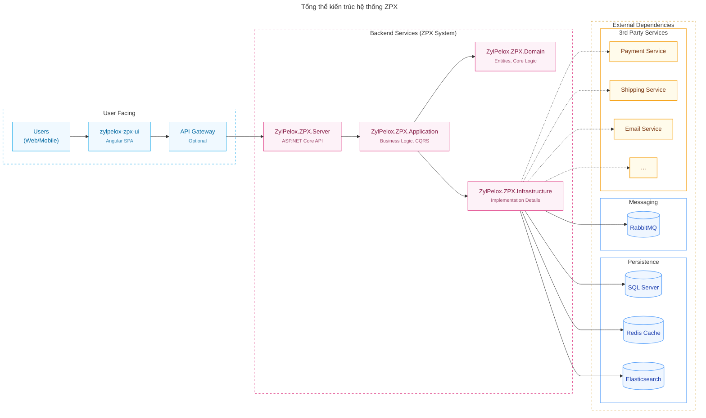
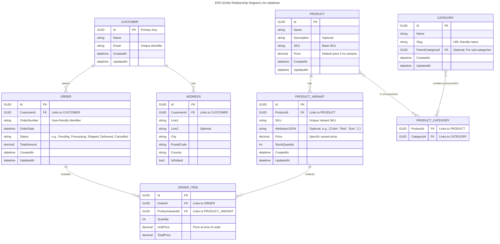
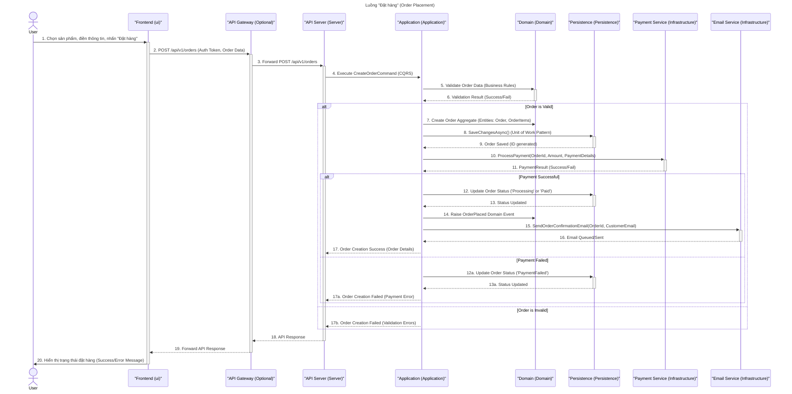
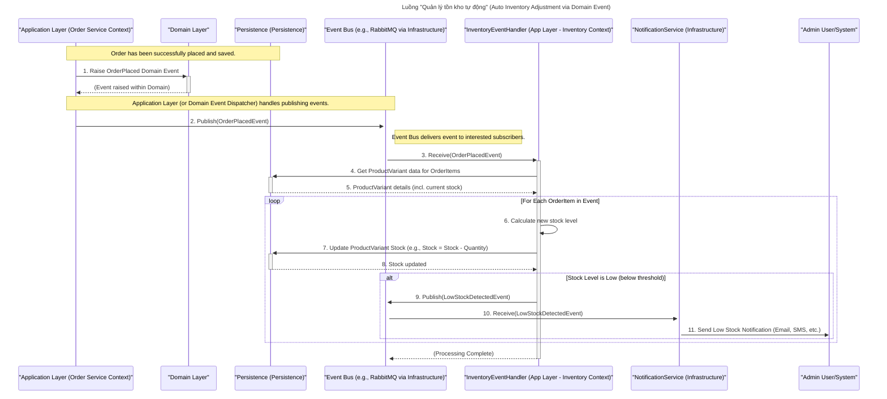

# 📑 Phân tích và Thiết kế Hệ thống ZylPelox (ZPX) - VERSION 1.3

**Mã dự án:** ZPX-ECOM
**Ngày khởi tạo:** 10-02-2023
**Ngày cập nhật:** 14-04-2025
**Tác giả:** phamtiendungcw
**Phiên bản:** 1.3

---

## 1. TỔNG QUAN DỰ ÁN

### 1.1. Mục tiêu

Xây dựng nền tảng cửa hàng bán lẻ trực tuyến ZylPelox (ZPX) với kiến trúc hiện đại, tích hợp đầy đủ tính năng quản lý từ đầu đến cuối, đáp ứng nhu cầu kinh doanh đa kênh với khả năng mở rộng cao và bảo trì dễ dàng.

> **_Chú thích:_** _Dự án nhằm tạo ra một nền tảng eCommerce toàn diện, không chỉ đáp ứng nhu cầu hiện tại mà còn có khả năng mở rộng trong tương lai._

### 1.2. Phạm vi

- **Hệ thống quản lý bán hàng và tồn kho toàn diện**: Theo dõi sản phẩm, đơn hàng và tồn kho theo thời gian thực
- **Nền tảng eCommerce đầy đủ chức năng**: Trải nghiệm mua sắm trực tuyến liền mạch cho khách hàng
- **Tích hợp thanh toán và vận chuyển**: Hỗ trợ nhiều phương thức thanh toán và đối tác vận chuyển
- **Hệ thống CRM và quản lý khách hàng**: Quản lý thông tin và tương tác với khách hàng
- **Dashboard quản trị và báo cáo**: Công cụ phân tích dữ liệu và báo cáo toàn diện

> **_Chú thích:_** _Dự án sẽ bao gồm cả backend và frontend, API được thiết kế để dễ dàng mở rộng và tích hợp với các hệ thống khác._

### 1.3. Giới hạn

- **Khối lượng dữ liệu và truy cập**: Hệ thống được thiết kế để xử lý khối lượng dữ liệu và người dùng từ trung bình đến lớn (lên đến 100,000 sản phẩm, 50,000 người dùng đồng thời)
- **Thời gian phát triển dự kiến**: 6-9 tháng cho phiên bản MVP, với lộ trình phát triển tiếp theo được chia thành các giai đoạn
- **Quy mô nhóm phát triển**: Yêu cầu đội ngũ 5-8 người bao gồm backend, frontend, QA và DevOps

> **_Chú thích:_** _Các giới hạn được xác định để đặt kỳ vọng rõ ràng và đảm bảo việc lập kế hoạch tài nguyên phù hợp._

---

## 2. YÊU CẦU CHỨC NĂNG (TÍNH NĂNG HỆ THỐNG)

### 2.1. Quản lý Catalog

- **Sản phẩm và biến thể**
  - Tạo/sửa/xóa/khôi phục sản phẩm với giao diện quản trị trực quan
  - Quản lý biến thể không giới hạn (màu sắc, kích thước, v.v.)
  - Thông số kỹ thuật và mô tả đa dạng với định dạng phong phú (rich text)
  - Giá cả và thuế có thể cấu hình theo khu vực

> **_Chú thích:_** _Hệ thống sẽ hỗ trợ sản phẩm đơn giản và sản phẩm có nhiều biến thể. Mỗi biến thể có thể có giá, mã SKU và tồn kho riêng._

- **Danh mục**
  - Cấu trúc danh mục đa cấp không giới hạn độ sâu
  - Sản phẩm có thể thuộc nhiều danh mục khác nhau
  - SEO tối ưu cho từng danh mục (meta title, description, URL)

> **_Chú thích:_** _Danh mục sẽ được thiết kế với hiệu suất cao, đảm bảo thời gian phản hồi nhanh ngay cả khi có hàng nghìn sản phẩm._

- **Quản lý phương tiện**
  - Thư viện hình ảnh/video tập trung với bộ lọc và tìm kiếm
  - Tối ưu hóa hình ảnh tự động (nén, thay đổi kích thước, chuyển đổi định dạng)
  - Hỗ trợ CDN để tăng tốc tải trang

> **_Chú thích:_** _Hệ thống sẽ sử dụng dịch vụ lưu trữ đám mây cho media để đảm bảo hiệu suất và khả năng mở rộng._

### 2.2. Quản lý Khách hàng

- **Hồ sơ khách hàng chi tiết**: Thông tin cá nhân, lịch sử mua hàng, sở thích
- **Phân nhóm khách hàng và tags**: Phân loại khách hàng để tiếp thị và phân tích
- **Lịch sử mua hàng và tương tác**: Theo dõi toàn bộ hành trình khách hàng
- **Hệ thống đánh giá và điểm thưởng**: Khuyến khích khách hàng quay lại
- **Quản lý địa chỉ giao hàng/thanh toán**: Hỗ trợ nhiều địa chỉ cho mỗi khách hàng

> **_Chú thích:_** _Module này sẽ tích hợp với hệ thống CRM để cung cấp cái nhìn 360 độ về khách hàng._

### 2.3. Quản lý Kho hàng

- **Theo dõi tồn kho theo thời gian thực**: Cập nhật số lượng tồn kho ngay khi có thay đổi
- **Nhập/xuất kho với lịch sử đầy đủ**: Theo dõi mọi thay đổi tồn kho
- **Quản lý nhiều kho và vị trí**: Hỗ trợ mô hình kinh doanh phân tán
- **Cảnh báo tồn kho thấp**: Thông báo khi sản phẩm gần hết hàng
- **Báo cáo tồn kho và giá trị hàng hóa**: Phân tích giá trị tồn kho theo thời gian

> **_Chú thích:_** _Hệ thống kho sẽ được thiết kế để xử lý cả quy trình thủ công và tự động, tích hợp với các thiết bị quét mã vạch nếu cần._

### 2.4. Quản lý Vận chuyển

- **Tích hợp nhiều đối tác vận chuyển**: API-based integration với các đơn vị vận chuyển phổ biến
- **Ma trận phí vận chuyển tùy chỉnh**: Xác định phí vận chuyển dựa trên khu vực, trọng lượng, giá trị
- **Theo dõi trạng thái vận chuyển**: Cập nhật theo thời gian thực về tình trạng đơn hàng
- **In ấn vận đơn và đóng gói**: Tự động tạo và in vận đơn
- **Xử lý hoàn hàng**: Quy trình hoàn hàng và hoàn tiền đầy đủ

> **_Chú thích:_** _Module này sẽ cung cấp API mở để dễ dàng tích hợp với các nhà cung cấp dịch vụ vận chuyển mới._

### 2.5. Quản lý Thanh toán

- **Đa dạng phương thức thanh toán**: Hỗ trợ thẻ tín dụng, chuyển khoản, ví điện tử, COD
- **Xử lý thanh toán an toàn**: Tuân thủ PCI DSS và tiêu chuẩn bảo mật
- **Lịch sử giao dịch và hoàn tiền**: Theo dõi đầy đủ các giao dịch tài chính
- **Hỗ trợ trả góp và thanh toán một phần**: Linh hoạt trong các phương thức thanh toán
- **Xác thực thanh toán**: Tích hợp 3D Secure và các phương thức xác thực hiện đại

> **_Chú thích:_** _Hệ thống thanh toán sẽ được thiết kế với tính mở rộng cao, cho phép thêm mới các cổng thanh toán dễ dàng._

### 2.6. Quản lý Đơn hàng

- **Quy trình xử lý đơn hàng linh hoạt**: Tùy chỉnh quy trình theo nhu cầu kinh doanh
- **Trạng thái đơn hàng tùy chỉnh**: Tạo và quản lý các trạng thái đơn hàng theo yêu cầu
- **Lịch sử thay đổi đơn hàng**: Theo dõi mọi thay đổi trong vòng đời đơn hàng
- **Đơn hàng dự trữ và đặt trước**: Hỗ trợ đặt hàng trước khi sản phẩm có sẵn
- **Bán hàng chéo và bán thêm**: Đề xuất sản phẩm liên quan khi đặt hàng

> **_Chú thích:_** _Module đơn hàng là trung tâm của hệ thống, tích hợp với tất cả các module khác để cung cấp trải nghiệm xuyên suốt._

### 2.7. Khuyến mãi & Giảm giá

- **Mã giảm giá và voucher**: Tạo và quản lý các mã giảm giá với nhiều điều kiện
- **Chương trình khuyến mãi theo thời gian**: Lên lịch khuyến mãi tự động
- **Giảm giá theo nhóm khách hàng**: Giá đặc biệt cho khách hàng VIP
- **Giảm giá theo số lượng**: Giảm giá khi mua số lượng lớn
- **Quà tặng và sản phẩm kèm theo**: Thêm sản phẩm quà tặng vào đơn hàng

> **_Chú thích:_** _Hệ thống khuyến mãi được thiết kế để hỗ trợ các chiến dịch marketing phức tạp với nhiều quy tắc kết hợp._

### 2.8. Nội dung & Marketing

- **Blog và bài viết**: Hệ thống quản lý nội dung tích hợp
- **Landing page và banner quảng cáo**: Tạo và quản lý các trang đích cho chiến dịch
- **SEO tools và metadata**: Tối ưu hóa nội dung cho công cụ tìm kiếm
- **Email marketing templates**: Tạo và gửi email marketing từ hệ thống
- **Đánh giá và bình luận sản phẩm**: Thu thập phản hồi của khách hàng

> **_Chú thích:_** _Module này sẽ cung cấp các công cụ để quản lý nội dung và tối ưu hóa SEO một cách hiệu quả._

### 2.9. Nhân viên & Phân quyền

- **Quản lý người dùng và vai trò**: Tạo và quản lý tài khoản nhân viên
- **Phân quyền chi tiết theo chức năng**: Kiểm soát quyền truy cập đến cấp độ hành động
- **Theo dõi hoạt động người dùng**: Ghi lại mọi thay đổi và hành động trong hệ thống
- **Xác thực hai lớp**: Tăng cường bảo mật cho tài khoản quan trọng
- **Giới hạn theo IP và thời gian**: Kiểm soát thời gian và địa điểm truy cập

> **_Chú thích:_** _Hệ thống phân quyền sẽ được thiết kế để linh hoạt và chi tiết, cho phép tạo các vai trò tùy chỉnh theo nhu cầu cụ thể của doanh nghiệp._

---

## 3. KIẾN TRÚC & CÔNG NGHỆ

### 3.1. Stack Công nghệ

- **Backend**: ASP.NET Core 6+
- **Frontend**: Angular 16+ (project `zylpelox-zpx-ui`)
- **Database**: SQL Server
- **Cache**: Redis + HybridCache (In-Memory + Distributed)
- **Search (Optional)**: Elasticsearch
- **Message Queue (Optional)**: RabbitMQ

> **_Chú thích:_** _Stack được chọn để đảm bảo hiệu suất, bảo mật, khả năng mở rộng và hỗ trợ cộng đồng tốt._

### 3.2. Kiến trúc Phần mềm

#### 3.2.1. Nguyên tắc cốt lõi

- **Clean Architecture**
  - Domain-centric: Đặt logic nghiệp vụ ở trung tâm
  - Tách biệt các mối quan tâm: Domain, Application, Infrastructure, Presentation
  - Dependency Rule: Các phụ thuộc chỉ hướng vào trong (domain core)

> **_Chú thích:_** _Clean Architecture giúp tạo ra code dễ bảo trì, dễ test và độc lập với các framework, database hay UI._

- **Domain-Driven Design**
  - Aggregate Roots: Xác định ranh giới nhất quán của dữ liệu
  - Bounded Context: Phân chia hệ thống thành các ngữ cảnh có ý nghĩa
  - Entity và Value Objects: Phân biệt rõ ràng giữa các đối tượng có danh tính và không có danh tính

> **_Chú thích:_** _DDD giúp mô hình hóa các domain phức tạp và đảm bảo rằng code phản ánh đúng business rules._

- **Modular Monolith**
  - Khả năng chuyển đổi sang Microservices sau này
  - Module separation: Tách biệt rõ ràng giữa các module
  - Shared kernel: Chia sẻ các khái niệm chung giữa các module

> **_Chú thích:_** _Modular Monolith là lựa chọn cân bằng giữa tính đơn giản của monolith và tính linh hoạt của microservices._

#### 3.2.2. Sơ đồ Kiến trúc Tổng thể



### 3.3. Design Patterns Chính

- **CQRS với MediatR**
  - Commands (Write): Thay đổi trạng thái hệ thống
  - Queries (Read): Truy vấn dữ liệu, không thay đổi trạng thái
  - Notifications (Events): Thông báo sự kiện đến các handler khác nhau

> **_Chú thích:_** _CQRS giúp tách biệt logic đọc và ghi, cho phép tối ưu hóa riêng cho mỗi loại, đặc biệt hữu ích cho hệ thống có tỉ lệ đọc/ghi chênh lệch._

- **Repository & Specification Pattern**
  - Generic Repository: Interface chung cho việc truy xuất dữ liệu
  - Specification abstraction: Đóng gói logic truy vấn

> **_Chú thích:_** _Repository pattern giúp tách biệt logic truy cập dữ liệu khỏi domain logic, trong khi Specification pattern giúp tái sử dụng và kết hợp các điều kiện truy vấn._

- **Domain Events**
  - Event publishing: Phát hành sự kiện khi có thay đổi trong domain
  - Event handling: Xử lý các tác động phụ do sự kiện gây ra

> **_Chú thích:_** _Domain Events cho phép các phần khác nhau của hệ thống phản ứng với những thay đổi mà không cần kết nối trực tiếp, giúp giảm sự phụ thuộc._

### 3.4. Packages & Libraries Chính

#### 3.4.1. Backend (.NET)

- **MediatR**: Triển khai CQRS và xử lý sự kiện
- **FluentValidation**: Validation dựa trên fluent interface
- **AutoMapper**: Mapping giữa các đối tượng
- **FluentResults**: Xử lý kết quả với nhiều trạng thái
- **Serilog**: Logging có cấu trúc
- **Ardalis.Specification**: Triển khai pattern Specification
- **EFCore.BulkExtensions**: Tối ưu các thao tác hàng loạt
- **BCrypt.Net-Next**: Mã hóa mật khẩu
- **Swashbuckle**: Tài liệu API (Swagger)

> **_Chú thích:_** _Các thư viện được chọn dựa trên độ tin cậy, hiệu suất và mức độ hỗ trợ tốt từ cộng đồng._

#### 3.4.2. Frontend (Angular)

- **Angular Material**: Thành phần UI
- **NgRx**: Quản lý state
- **RxJS**: Lập trình reactive
- **Angular Flex Layout**: Layout phản hồi
- **NgxTranslate**: Đa ngôn ngữ

> **_Chú thích:_** _Các thư viện frontend được chọn để cung cấp trải nghiệm người dùng nhất quán và hiệu suất cao._

### 3.5. Cấu trúc Solution

```plaintext
📁 ZylPelox
 ├── 📁 Core
 │   ├── 📁 ZylPelox.ZPX.Domain                 // Logic nghiệp vụ cốt lõi
 │   │   ├── 📁 Entities                        // Các entity cơ bản
 │   │   ├── 📁 Aggregates                      // Các aggregate roots
 │   │   │   ├── 📁 Product
 │   │   │   ├── 📁 Order
 │   │   │   ├── 📁 Customer
 │   │   │   ├── 📁 Inventory
 │   │   │   └── 📁 ...
 │   │   ├── 📁 JunctionEntities                // Entity mối quan hệ nhiều-nhiều
 │   │   ├── 📁 ValueObjects                    // Value objects
 │   │   ├── 📁 Events                          // Domain events
 │   │   ├── 📁 Exceptions                      // Domain exceptions
 │   │   └── 📁 Services                        // Domain services
 │   │
 │   ├── 📁 ZylPelox.ZPX.Application            // Logic ứng dụng
 │   │    ├── 📁 Common
 │   │    │   ├── 📁 Behaviors                  // Pipeline behaviors (validation, logging)
 │   │    │   ├── 📁 Specifications             // Query specifications
 │   │    │   └── 📁 Exceptions                 // Application exceptions
 │   │    ├── 📁 Contracts
 │   │    │   ├── 📁 Persistence                // Persistence interfaces
 │   │    │   │   └── 📁 Repositories           // Repository interfaces
 │   │    │   ├── 📁 Infrastructure             // Infrastructure interfaces
 │   │    │   └── 📁 Identity                   // Identity interfaces
 │   │    ├── 📁 Features                       // CQRS features
 │   │    │   ├── 📁 Products                   // Product-related commands/queries
 │   │    │   ├── 📁 Orders                     // Order-related commands/queries
 │   │    │   ├── 📁 Customers                  // Customer-related commands/queries
 │   │    │   ├── 📁 Inventory                  // Inventory-related commands/queries
 │   │    │   └── 📁 ...                        // Other features
 │   │    └── 📁 EventHandlers                  // Domain event handlers
 |   │
 │   └── 📁 ZylPelox.ZPX.SharedKernel           // Shared utilities and DTOs
 │       ├── 📁 Constants                       // Shared constants
 │       ├── 📁 Extensions                      // Extension methods
 │       └── 📁 Utilities                       // Utility classes
 │
 ├── 📁 Infrastructure
 │   ├── 📁 ZylPelox.ZPX.Infrastructure         // Dịch vụ cơ sở hạ tầng
 │   │   ├── 📁 Cache                           // Caching implementation
 │   │   ├── 📁 Email                           // Email service
 │   │   ├── 📁 FileStorage                     // File storage service
 │   │   ├── 📁 MessageBroker                   // Message broker integration
 │   │   └── 📁 ThirdPartyServices              // Third-party integrations
 │   │
 │   ├── 📁 ZylPelox.ZPX.Persistence            // Truy cập dữ liệu
 │   │   ├── 📁 Configurations                  // EF Core configurations
 │   │   ├── 📁 Repositories                    // Repository implementations
 │   │   └── 📁 Migrations                      // Database migrations
 │   │
 │   └── 📁 ZylPelox.ZPX.Identity               // Xác thực và phân quyền
 │       ├── 📁 Models                          // Identity models
 │       ├── 📁 Services                        // Identity services
 │       └── 📁 Configurations                  // Identity configurations
 │
 ├── 📁 Presentation
 │   ├── 📁 ZylPelox.ZPX.Server                 // Web API
 │   │   ├── 📁 Controllers                     // API controllers
 │   │   ├── 📁 Filters                         // Action filters
 │   │   ├── 📁 Middleware                      // Custom middleware
 │   │   └── 📁 Configurations                  // API configurations
 │   │
 │   └── 📁 ZylPelox.ZPX.UI                     // Angular frontend
 │       ├── 📁 src
 │       │   ├── 📁 app
 │       │   │   ├── 📁 core                    // Core functionality
 │       │   │   ├── 📁 shared                  // Shared components
 │       │   │   └── 📁 features                // Feature modules
 │       │   ├── 📁 assets                      // Static assets
 │       │   └── 📁 environments                // Environment configurations
 │       └── 📁 angular.json                    // Angular configuration
 │
 └── 📁 Tests                                   // Tests
     ├── 📁 ZylPelox.ZPX.UnitTests              // Unit tests
     ├── 📁 ZylPelox.ZPX.IntegrationTests       // Integration tests
     └── 📁 ZylPelox.ZPX.E2ETests               // End-to-end tests
```

> _**Chú thích:**_ _Cấu trúc tuân theo Clean Architecture, phụ thuộc hướng vào Core._

---

## 4. THIẾT KẾ CHI TIẾT

### 4.1. Domain Design

- **Entities & Base Classes**: `BaseEntity` (Guid Id), `BaseAuditableEntity` (thêm CreatedAt, CreatedBy, LastModifiedAt, LastModifiedBy, IsDeleted...).
- **Aggregate Roots**: Product, Order, Customer, Inventory, Promotion (quản lý các entity liên quan như một đơn vị nhất quán).
- **Junction/Intermediate Entities**: ProductCategory, ProductTag, OrderDiscount... (quản lý quan hệ N-N).
- **Value Objects**: Money, Address, DateRange, ContactInformation... (bất biến, định nghĩa bởi thuộc tính).
- **Domain Services**: OrderProcessingService, PricingService... (chứa logic nghiệp vụ phức tạp không thuộc entity nào).
- **Domain Events**: OrderPlacedEvent, PaymentReceivedEvent... (thông báo các thay đổi quan trọng).

### 4.2. Application Layer Details

- **CQRS Implementation**: Commands (CreateProductCommand...), Queries (GetProductsQuery...), Handlers tương ứng.
- **DTOs & Mapping**: Request DTOs (CreateProductRequest...), Response DTOs (ProductDto...), Mapping Profiles (AutoMapper).
- **Validation**: Validators (CreateProductValidator...) với FluentValidation, Validation Behavior (MediatR Pipeline).
- **Application Services Interfaces**: IEmailService, IFileStorageService, ICacheService... (định nghĩa contracts cho infrastructure).

### 4.3. API Design & Endpoints

- **Nguyên tắc RESTful**: Resource-based URLs, HTTP methods đúng, status codes phù hợp, hỗ trợ Paging/Filtering/Sorting.
- **API Versioning**: URL-based (`/api/v1/...`).
- **API Documentation**: Tích hợp Swagger/OpenAPI, ví dụ request/response, changelog.
- **Controller Example**:

    ```csharp
    [ApiController]
    [Route("api/v1/[controller]")]
    public class ProductsController : ControllerBase // Kế thừa từ ControllerBase hoặc BaseApiController tùy chỉnh
    {
        private readonly IMediator _mediator; // Hoặc ISender/IPublisher

        public ProductsController(IMediator mediator) => _mediator = mediator;

        [HttpGet]
        [ProducesResponseType(typeof(PaginatedList<ProductDto>), StatusCodes.Status200OK)]
        public async Task<IActionResult> GetProducts([FromQuery] GetProductsQuery query)
        {
            var result = await _mediator.Send(query);
            // Có thể thêm xử lý lỗi chung hoặc trả về Ok trực tiếp nếu dùng middleware/filter
            return Ok(result);
        }

        // ... các endpoints khác (GET by Id, POST, PUT, DELETE) với xử lý lỗi và trả về ActionResult phù hợp
    }
    ```

### 4.4. Database Design

#### 4.4.1. Tổng quan Schema

- Nhóm bảng liên quan đến Product (Products, Categories, Brands, ProductImages...).
- Nhóm bảng liên quan đến Order (Orders, OrderItems, OrderStatuses...).
- Nhóm bảng liên quan đến Customer (Customers, Addresses...).
- Nhóm bảng Inventory (Inventory, Warehouses, InventoryHistory...).
- Nhóm bảng Identity (AspNetUsers, AspNetRoles...).
- Nhóm bảng Marketing (Discounts...).
- Nhóm bảng Reviews (ProductReviews...).
- Bảng trung gian (Junction tables).

#### 4.4.2. Sơ đồ Quan hệ Thực thể (ERD)



> _**Chú thích:**_ _Đây là ERD giản lược các thực thể và mối quan hệ chính. Xem **Phụ lục B** để có chi tiết đầy đủ về schema._

#### 4.4.3. Entity Framework Core Configuration Example

```csharp
public class ProductConfiguration : IEntityTypeConfiguration<Product>
{
    public void Configure(EntityTypeBuilder<Product> builder)
    {
        builder.ToTable("Products"); // Đặt tên bảng rõ ràng
        builder.HasKey(p => p.Id);

        builder.Property(p => p.Name).IsRequired().HasMaxLength(200);
        builder.Property(p => p.Price).HasColumnType("decimal(18,2)"); // Định nghĩa kiểu dữ liệu DB

        // Quan hệ với Variants
        builder.HasMany(p => p.Variants)
               .WithOne(v => v.Product)
               .HasForeignKey(v => v.ProductId)
               .OnDelete(DeleteBehavior.Cascade); // Hoặc Restrict tùy logic nghiệp vụ

        // Quan hệ với Category (1-N)
        builder.HasOne(p => p.Category)
               .WithMany(c => c.Products)
               .HasForeignKey(p => p.CategoryId)
               .OnDelete(DeleteBehavior.SetNull); // Hoặc Restrict

        // Cấu hình Index
        builder.HasIndex(p => p.Name);
        builder.HasIndex(p => p.Sku).IsUnique(); // Nếu SKU là duy nhất

        // Cấu hình Soft Delete Filter
        builder.HasQueryFilter(p => !p.IsDeleted);
    }
}
```

#### 4.4.4. Migration Strategy

- Code-First approach, Incremental migrations, Schema versioning, Data seeding cho lookup tables.

#### 4.4.5. Performance Considerations

- Indexing phù hợp, Batch operations (BulkExtensions), Tối ưu truy vấn đọc (CQRS), Tránh N+1 problem (Eager/Explicit loading).

### 4.5. Frontend Architecture (`ZylPelox.ZPX.UI`)

- **Terminal**: ng new zylpelox-zpx-ui --routing --style=scss --skip-git --package-manager=npm --directory=src/Presentation/ZylPelox.ZPX.UI
- **Cấu trúc**: Core Module, Shared Module, Feature Modules (lazy-loaded).
- **State Management**: NgRx (cho state phức tạp/toàn cục), Services + RxJS (cho state đơn giản), Local component state.
- **UI Components**: Base trên Angular Material, Custom components mở rộng, Responsive (Flex Layout).
- **Routing & Navigation**: Feature-based, Route Guards, Lazy-loading.
- **Internationalization (I18n)**: NgxTranslate, định dạng currency/date theo locale, hỗ trợ RTL.
- **Tailwind CSS**: Sử dụng Tailwind CSS cho styling, Responsive design, Utility-first approach.

---

## 5. CÁC VẤN ĐỀ XUYÊN SUỐT (CROSS-CUTTING CONCERNS)

### 5.1. Error Handling & Logging

- **Exception Handling**: Custom domain exceptions with prefix name [Zpx]NameExceptions.cs (`ZpxNotFoundException`...), Global exception middleware, Structured error responses.
- **Logging Strategy**: Structured logging (Serilog), Log levels, Log enrichment, Log storage/rotation.
- **Monitoring**: Health checks, Application metrics, Performance counters, API usage statistics.

### 5.2. Security Considerations

- **Authentication & Authorization**: JWT, Role-based, Policy-based, Refresh token strategy.
- **Data Protection**: HTTPS, Encryption (at rest/in transit), Input validation/sanitization, CSRF protection.
- **API Security**: Rate limiting, Request validation, API keys, CORS configuration.

### 5.3. Caching Strategy

- **Cache Levels**: Memory cache (L1), Distributed cache - Redis (L2), Browser caching.
- **Cache Invalidation**: Time-based, Event-based, Cache dependencies.
- **Cacheable Resources**: Product catalog, User preferences, Lookup data, Session data.

### 5.4. E2ETests

- **End-to-End Testing**: Cypress, Test critical user flows, UI/UX validation, API contract tests.
- **Test Scenarios**: User registration, Product search, Order placement, Payment processing, Admin operations.

### 5.5. Registration Service

- **Name Static class**: [ProjectName]ServiceRegistration.cs
- **Register Services**: Use `IServiceCollection` to register all services, repositories, and configurations.

---

## 6. QUY TRÌNH PHÁT TRIỂN & VẬN HÀNH

### 6.1. Testing Approach

- **Unit Testing**: Domain logic, Application handlers, Services (xUnit, Moq).
- **Integration Testing**: Repositories, API endpoints, Database interactions (xUnit, TestContainers/In-Memory DB).
- **E2E Testing**: Critical user flows, UI/UX (Cypress/Playwright).

### 6.2. Deployment & DevOps

- **CI/CD Pipeline**: Automated builds (GitHub Actions/Azure DevOps), automated testing, static code analysis, deployment automation.
- **Environments**: Development, Testing/QA, Staging, Production.
- **Deployment Strategy**: Docker containerization, Azure App Service/Kubernetes, Blue-green/Canary deployment.

### 6.3. Coding Standards & Quality

- **Naming Conventions**: Nhất quán (DTOs, Specs, Exceptions...).
- **Code Quality Tools**: SonarLint/SonarQube, StyleCop, EditorConfig, Quality gates in CI/CD.
- **Documentation**: Code comments (XML Doc), Architecture docs, API docs (Swagger), User guides.
- **Development Practices**: Code reviews, Pull request workflow, Feature branch strategy, TDD (khi phù hợp).

---

## 7. QUẢN LÝ DỰ ÁN

### 7.1. Roadmap & Phasing

- **Phase 0: Planning & Setup (Month 0)**: Xác định yêu cầu chi tiết, Thiết lập môi trường phát triển, Kiến trúc tổng thể.
- **Phase 1: MVP (Month 1-3)**: Catalog, Order cơ bản, Customer accounts, Admin dashboard, 1-2 Payment providers.
- **Phase 2: Enhanced Features (Month 4-6)**: Inventory, Advanced search, Promotions, Reviews, Thêm payment options.
- **Phase 3: Advanced Features (Month 7-9)**: Analytics, Marketing tools, Multi-vendor (opt), Mobile app (opt), 3rd Party API.
- **Phase 4: Optimization & Scaling (Month 10+)**: Performance tuning, Security hardening, Scalability improvements, Monitoring setup.
- **Phase 5: Maintenance & Support (Ongoing)**: Bug fixes, Feature requests, Technical debt management, Regular updates.
- **Phase 6: Review & Retrospective (Ongoing)**: Đánh giá quy trình phát triển, Học hỏi từ các vấn đề gặp phải, Cải tiến quy trình.
- **Phase 7: Future Planning (Ongoing)**: Lên kế hoạch cho các tính năng mới, Cập nhật công nghệ, Mở rộng hệ thống.
- **Phase 8: Community Engagement (Ongoing)**: Tương tác với cộng đồng người dùng, Thu thập phản hồi, Cải tiến dựa trên nhu cầu thực tế.
- **Phase 9: Documentation & Training (Ongoing)**: Cập nhật tài liệu, Hướng dẫn sử dụng, Đào tạo cho người dùng và nhà phát triển mới.
- **Phase 10: Long-term Support (LTS) Planning (Ongoing)**: Lên kế hoạch cho các phiên bản hỗ trợ lâu dài, Bảo trì và cập nhật định kỳ.
- **Phase 11: Scalability & Performance Enhancements (Ongoing)**: Tối ưu hóa hiệu suất, Mở rộng quy mô hệ thống, Cải tiến kiến trúc khi cần thiết.
- **Phase 12: Innovation & New Features (Ongoing)**: Nghiên cứu công nghệ mới, Thêm các tính năng sáng tạo, Cập nhật theo xu hướng thị trường.
- **Phase 13: Community Contributions (Ongoing)**: Khuyến khích cộng đồng đóng góp mã nguồn, Tích hợp các tính năng từ cộng đồng, Quản lý pull requests.
- **Phase 14: Legacy Code Management (Ongoing)**: Quản lý mã nguồn cũ, Cải tiến và refactor khi cần thiết, Đảm bảo tính tương thích ngược.
- **Phase 15: Compliance & Legal Considerations (Ongoing)**: Đảm bảo tuân thủ các quy định pháp lý, Bảo vệ dữ liệu người dùng, Quản lý giấy phép phần mềm.
- Use **Agile/Scrum**: Sprints, Backlog grooming, Daily standups, Sprint reviews/retrospectives.

### 7.2. Resource Requirements & Timeline

#### 7.2.1. Development Team

- 1 Tech Lead/Architect, 3-4 Backend Devs, 2 Frontend Devs, 1 QA Engineer, 1 DevOps (part-time).

#### 7.2.2. Infrastructure

- Dev, Test/QA, Staging, Production environments, CI/CD pipeline, Source control.

#### 7.2.3. Estimated Timeline

- Planning & Setup: 2-3 weeks
- MVP Development: 2-3 months
- Testing & Refinement: 1 month
- Enhanced Features: 3 months
- Advanced Features: 3 months

---

## 8. PHỤ LỤC

### Phụ lục A: Diagram Quy trình Nghiệp vụ

#### A.1. Sequence Diagram: Luồng "Đặt hàng" (Order Placement)



#### A.2. Sequence Diagram: Luồng "Quản lý tồn kho tự động" (Auto Inventory Adjustment)



### Phụ lục B: Chi tiết Schema Database

> **Ngày hiện tại:** 2024-06-15 19:10:01
> **Người dùng:** phamtiendungcw

#### Tổng quan các nhóm bảng

1. **Identity Tables** - Quản lý người dùng và xác thực
2. **Core eCommerce Tables** - Sản phẩm, danh mục, đơn hàng
3. **Customer Management Tables** - Khách hàng, địa chỉ
4. **Inventory & Stock Tables** - Quản lý hàng tồn kho
5. **Review & Rating Tables** - Đánh giá sản phẩm
6. **Marketing Tables** - Khuyến mãi, mã giảm giá
7. **Logging & Audit Tables** - Ghi log hệ thống

#### Identity Tables

##### 1. AspNetUsers (Bảng Identity mặc định)

| Column Name          | Data Type      | Constraints | Description             |
| -------------------- | -------------- | ----------- | ----------------------- |
| Id                   | nvarchar(450)  | PK          | Định danh người dùng    |
| UserName             | nvarchar(256)  |             | Tên đăng nhập           |
| NormalizedUserName   | nvarchar(256)  | INDEX       | Tên đăng nhập chuẩn hóa |
| Email                | nvarchar(256)  |             | Email                   |
| NormalizedEmail      | nvarchar(256)  | INDEX       | Email chuẩn hóa         |
| EmailConfirmed       | bit            |             | Email đã xác nhận       |
| PasswordHash         | nvarchar(max)  |             | Mật khẩu đã hash        |
| SecurityStamp        | nvarchar(max)  |             | Dùng cho bảo mật        |
| ConcurrencyStamp     | nvarchar(max)  |             | Kiểm soát đồng thời     |
| PhoneNumber          | nvarchar(max)  |             | Số điện thoại           |
| PhoneNumberConfirmed | bit            |             | SĐT đã xác nhận         |
| TwoFactorEnabled     | bit            |             | Xác thực 2 yếu tố       |
| LockoutEnd           | datetimeoffset |             | Thời gian khóa hết hạn  |
| LockoutEnabled       | bit            |             | Khóa tài khoản          |
| AccessFailedCount    | int            |             | Số lần đăng nhập sai    |
| FirstName            | nvarchar(100)  |             | Tên                     |
| LastName             | nvarchar(100)  |             | Họ                      |
| ProfilePictureUrl    | nvarchar(500)  |             | URL ảnh đại diện        |

##### 2. AspNetRoles

| Column Name      | Data Type     | Constraints | Description           |
| ---------------- | ------------- | ----------- | --------------------- |
| Id               | nvarchar(450) | PK          | Định danh vai trò     |
| Name             | nvarchar(256) |             | Tên vai trò           |
| NormalizedName   | nvarchar(256) | INDEX       | Tên vai trò chuẩn hóa |
| ConcurrencyStamp | nvarchar(max) |             | Kiểm soát đồng thời   |

##### 3. AspNetUserRoles

| Column Name | Data Type     | Constraints | Description   |
| ----------- | ------------- | ----------- | ------------- |
| UserId      | nvarchar(450) | PK, FK      | ID người dùng |
| RoleId      | nvarchar(450) | PK, FK      | ID vai trò    |

##### 4. AspNetUserClaims, AspNetRoleClaims, AspNetUserLogins, AspNetUserTokens

> **_Chú thích:_** _Các bảng Identity khác được tự động tạo bởi EFCore, không cần cấu hình thêm._

#### 🛒 Core eCommerce Tables

##### 5. Products

| Column Name           | Data Type        | Constraints                     | Description                   |
| --------------------- | ---------------- | ------------------------------- | ----------------------------- |
| Id                    | uniqueidentifier | PK                              | Định danh sản phẩm            |
| Name                  | nvarchar(200)    | NOT NULL, INDEX                 | Tên sản phẩm                  |
| Description           | nvarchar(max)    |                                 | Mô tả sản phẩm                |
| ShortDescription      | nvarchar(500)    |                                 | Mô tả ngắn                    |
| Price                 | decimal(18,2)    | NOT NULL                        | Giá gốc                       |
| OldPrice              | decimal(18,2)    |                                 | Giá cũ (khi giảm giá)         |
| SpecialPrice          | decimal(18,2)    |                                 | Giá đặc biệt                  |
| SpecialPriceStartDate | datetime2        |                                 | Ngày bắt đầu giá đặc biệt     |
| SpecialPriceEndDate   | datetime2        |                                 | Ngày kết thúc giá đặc biệt    |
| Sku                   | nvarchar(100)    | INDEX, UNIQUE                   | Stock Keeping Unit            |
| Gtin                  | nvarchar(100)    | INDEX                           | Global Trade Item Number      |
| CategoryId            | uniqueidentifier | FK, INDEX                       | ID danh mục                   |
| BrandId               | uniqueidentifier | FK, INDEX                       | ID thương hiệu                |
| IsActive              | bit              | NOT NULL, DEFAULT(1)            | Trạng thái kích hoạt          |
| IsFeatured            | bit              | NOT NULL, DEFAULT(0)            | Sản phẩm nổi bật              |
| IsDeleted             | bit              | NOT NULL, DEFAULT(0)            | Trạng thái xóa mềm            |
| CreatedAt             | datetime2        | NOT NULL, DEFAULT(GETUTCDATE()) | Ngày tạo                      |
| CreatedBy             | nvarchar(450)    | FK (AspNetUsers.Id)             | Người tạo                     |
| ModifiedAt            | datetime2        |                                 | Ngày sửa đổi                  |
| ModifiedBy            | nvarchar(450)    | FK (AspNetUsers.Id)             | Người sửa đổi                 |
| DeletedAt             | datetime2        |                                 | Ngày xóa                      |
| DeletedBy             | nvarchar(450)    | FK (AspNetUsers.Id)             | Người xóa                     |
| StockQuantity         | int              | NOT NULL, DEFAULT(0)            | **(Moved to ProductVariant)** |
| Weight                | decimal(18,4)    |                                 | **(Moved to ProductVariant)** |
| Length                | decimal(18,4)    |                                 | **(Moved to ProductVariant)** |
| Width                 | decimal(18,4)    |                                 | **(Moved to ProductVariant)** |
| Height                | decimal(18,4)    |                                 | **(Moved to ProductVariant)** |

##### 6. ProductVariants (NEW/MODIFIED Table for Variants)

| Column Name      | Data Type        | Constraints                       | Description           |
| ---------------- | ---------------- | --------------------------------- | --------------------- |
| Id               | uniqueidentifier | PK                                | Định danh biến thể    |
| ProductId        | uniqueidentifier | FK (Products.Id), NOT NULL, INDEX | ID sản phẩm cha       |
| Name             | nvarchar(200)    |                                   | Tên biến thể (nếu có) |
| Sku              | nvarchar(100)    | INDEX, UNIQUE                     | SKU của biến thể      |
| Price            | decimal(18,2)    | NOT NULL                          | Giá của biến thể      |
| OldPrice         | decimal(18,2)    |                                   | Giá cũ của biến thể   |
| StockQuantity    | int              | NOT NULL, DEFAULT(0)              | Số lượng tồn kho      |
| ReservedQuantity | int              | NOT NULL, DEFAULT(0)              | Số lượng đặt trước    |
| Weight           | decimal(18,4)    |                                   | Trọng lượng           |
| Length           | decimal(18,4)    |                                   | Chiều dài             |
| Width            | decimal(18,4)    |                                   | Chiều rộng            |
| Height           | decimal(18,4)    |                                   | Chiều cao             |
| AttributesJSON   | nvarchar(max)    |                                   | Thuộc tính (JSON)     |
| ImageUrl         | nvarchar(500)    |                                   | Ảnh đại diện biến thể |
| IsActive         | bit              | NOT NULL, DEFAULT(1)              | Trạng thái kích hoạt  |
| CreatedAt        | datetime2        | NOT NULL, DEFAULT(GETUTCDATE())   | Ngày tạo              |
| CreatedBy        | nvarchar(450)    | FK (AspNetUsers.Id)               | Người tạo             |
| ModifiedAt       | datetime2        |                                   | Ngày sửa đổi          |
| ModifiedBy       | nvarchar(450)    | FK (AspNetUsers.Id)               | Người sửa đổi         |

##### 7. ProductImages

| Column Name      | Data Type        | Constraints                       | Description                             |
| ---------------- | ---------------- | --------------------------------- | --------------------------------------- |
| Id               | uniqueidentifier | PK                                | Định danh ảnh                           |
| ProductId        | uniqueidentifier | FK (Products.Id), NOT NULL, INDEX | ID sản phẩm                             |
| ProductVariantId | uniqueidentifier | FK (ProductVariants.Id), INDEX    | ID biến thể (nếu ảnh riêng cho variant) |
| ImageUrl         | nvarchar(500)    | NOT NULL                          | URL ảnh                                 |
| AltText          | nvarchar(200)    |                                   | Văn bản thay thế                        |
| DisplayOrder     | int              | NOT NULL, DEFAULT(0)              | Thứ tự hiển thị                         |
| CreatedAt        | datetime2        | NOT NULL, DEFAULT(GETUTCDATE())   | Ngày tạo                                |
| CreatedBy        | nvarchar(450)    | FK (AspNetUsers.Id)               | Người tạo                               |

##### 8. ProductAttributes (Consider using JSON in Product or Variant)

| Column Name    | Data Type        | Constraints                       | Description          |
| -------------- | ---------------- | --------------------------------- | -------------------- |
| Id             | uniqueidentifier | PK                                | Định danh thuộc tính |
| ProductId      | uniqueidentifier | FK (Products.Id), NOT NULL, INDEX | ID sản phẩm          |
| AttributeName  | nvarchar(100)    | NOT NULL                          | Tên thuộc tính       |
| AttributeValue | nvarchar(500)    | NOT NULL                          | Giá trị thuộc tính   |
| DisplayOrder   | int              | NOT NULL, DEFAULT(0)              | Thứ tự hiển thị      |
| CreatedAt      | datetime2        | NOT NULL, DEFAULT(GETUTCDATE())   | Ngày tạo             |
| CreatedBy      | nvarchar(450)    | FK (AspNetUsers.Id)               | Người tạo            |

##### 9. Categories

| Column Name     | Data Type        | Constraints                     | Description          |
| --------------- | ---------------- | ------------------------------- | -------------------- |
| Id              | uniqueidentifier | PK                              | Định danh danh mục   |
| Name            | nvarchar(200)    | NOT NULL, INDEX                 | Tên danh mục         |
| Description     | nvarchar(500)    |                                 | Mô tả                |
| ParentId        | uniqueidentifier | FK (Categories.Id), INDEX       | ID danh mục cha      |
| DisplayOrder    | int              | NOT NULL, DEFAULT(0)            | Thứ tự hiển thị      |
| IsActive        | bit              | NOT NULL, DEFAULT(1)            | Trạng thái kích hoạt |
| ImageUrl        | nvarchar(500)    |                                 | URL hình ảnh         |
| Slug            | nvarchar(200)    | NOT NULL, INDEX, UNIQUE         | URL thân thiện       |
| MetaTitle       | nvarchar(200)    |                                 | Tiêu đề SEO          |
| MetaKeywords    | nvarchar(500)    |                                 | Từ khóa SEO          |
| MetaDescription | nvarchar(500)    |                                 | Mô tả SEO            |
| IsDeleted       | bit              | NOT NULL, DEFAULT(0)            | Trạng thái xóa mềm   |
| CreatedAt       | datetime2        | NOT NULL, DEFAULT(GETUTCDATE()) | Ngày tạo             |
| CreatedBy       | nvarchar(450)    | FK (AspNetUsers.Id)             | Người tạo            |
| ModifiedAt      | datetime2        |                                 | Ngày sửa đổi         |
| ModifiedBy      | nvarchar(450)    | FK (AspNetUsers.Id)             | Người sửa đổi        |
| DeletedAt       | datetime2        |                                 | Ngày xóa             |
| DeletedBy       | nvarchar(450)    | FK (AspNetUsers.Id)             | Người xóa            |

##### 10. Brands

| Column Name  | Data Type        | Constraints                     | Description           |
| ------------ | ---------------- | ------------------------------- | --------------------- |
| Id           | uniqueidentifier | PK                              | Định danh thương hiệu |
| Name         | nvarchar(200)    | NOT NULL, INDEX                 | Tên thương hiệu       |
| Description  | nvarchar(500)    |                                 | Mô tả                 |
| LogoUrl      | nvarchar(500)    |                                 | URL logo              |
| IsActive     | bit              | NOT NULL, DEFAULT(1)            | Trạng thái kích hoạt  |
| DisplayOrder | int              | NOT NULL, DEFAULT(0)            | Thứ tự hiển thị       |
| Slug         | nvarchar(200)    | NOT NULL, INDEX, UNIQUE         | URL thân thiện        |
| IsDeleted    | bit              | NOT NULL, DEFAULT(0)            | Trạng thái xóa mềm    |
| CreatedAt    | datetime2        | NOT NULL, DEFAULT(GETUTCDATE()) | Ngày tạo              |
| CreatedBy    | nvarchar(450)    | FK (AspNetUsers.Id)             | Người tạo             |
| ModifiedAt   | datetime2        |                                 | Ngày sửa đổi          |
| ModifiedBy   | nvarchar(450)    | FK (AspNetUsers.Id)             | Người sửa đổi         |
| DeletedAt    | datetime2        |                                 | Ngày xóa              |
| DeletedBy    | nvarchar(450)    | FK (AspNetUsers.Id)             | Người xóa             |

##### 11. Orders

| Column Name       | Data Type        | Constraints                            | Description            |
| ----------------- | ---------------- | -------------------------------------- | ---------------------- |
| Id                | uniqueidentifier | PK                                     | Định danh đơn hàng     |
| OrderNumber       | nvarchar(50)     | NOT NULL, INDEX, UNIQUE                | Số đơn hàng            |
| CustomerId        | uniqueidentifier | FK (Customers.Id), NOT NULL, INDEX     | ID khách hàng          |
| OrderDate         | datetime2        | NOT NULL, DEFAULT(GETUTCDATE())        | Ngày đặt hàng          |
| OrderStatusId     | int              | FK (OrderStatuses.Id), NOT NULL, INDEX | Trạng thái             |
| ShippingAddressId | uniqueidentifier | FK (Addresses.Id), NOT NULL            | Địa chỉ giao hàng      |
| BillingAddressId  | uniqueidentifier | FK (Addresses.Id)                      | Địa chỉ thanh toán     |
| PaymentMethodId   | int              | FK (PaymentMethods.Id)                 | Phương thức thanh toán |
| ShippingMethodId  | int              | FK (ShippingMethods.Id)                | Phương thức vận chuyển |
| SubTotal          | decimal(18,2)    | NOT NULL                               | Tổng tiền hàng         |
| ShippingCost      | decimal(18,2)    | NOT NULL, DEFAULT(0)                   | Phí vận chuyển         |
| TaxAmount         | decimal(18,2)    | NOT NULL, DEFAULT(0)                   | Thuế                   |
| DiscountAmount    | decimal(18,2)    | NOT NULL, DEFAULT(0)                   | Giảm giá               |
| TotalAmount       | decimal(18,2)    | NOT NULL                               | Tổng cộng              |
| Notes             | nvarchar(max)    |                                        | Ghi chú của KH         |
| AdminNotes        | nvarchar(max)    |                                        | Ghi chú của Admin      |
| CouponCode        | nvarchar(50)     | INDEX                                  | Mã giảm giá đã dùng    |
| IsDeleted         | bit              | NOT NULL, DEFAULT(0)                   | Trạng thái xóa mềm     |
| CreatedAt         | datetime2        | NOT NULL, DEFAULT(GETUTCDATE())        | Ngày tạo               |
| CreatedBy         | nvarchar(450)    | FK (AspNetUsers.Id)                    | Người tạo (Nếu KH tạo) |
| ModifiedAt        | datetime2        |                                        | Ngày sửa đổi           |
| ModifiedBy        | nvarchar(450)    | FK (AspNetUsers.Id)                    | Người sửa đổi          |
| DeletedAt         | datetime2        |                                        | Ngày xóa               |
| DeletedBy         | nvarchar(450)    | FK (AspNetUsers.Id)                    | Người xóa              |

##### 12. OrderItems

| Column Name        | Data Type        | Constraints                              | Description               |
| ------------------ | ---------------- | ---------------------------------------- | ------------------------- |
| Id                 | uniqueidentifier | PK                                       | Định danh mục đơn hàng    |
| OrderId            | uniqueidentifier | FK (Orders.Id), NOT NULL, INDEX          | ID đơn hàng               |
| ProductVariantId   | uniqueidentifier | FK (ProductVariants.Id), NOT NULL, INDEX | ID biến thể sản phẩm      |
| Quantity           | int              | NOT NULL                                 | Số lượng                  |
| UnitPrice          | decimal(18,2)    | NOT NULL                                 | Đơn giá tại thời điểm mua |
| TotalPrice         | decimal(18,2)    | NOT NULL                                 | Thành tiền                |
| ProductName        | nvarchar(200)    | NOT NULL                                 | Tên SP (snapshot)         |
| ProductVariantName | nvarchar(200)    |                                          | Tên biến thể (snapshot)   |
| Sku                | nvarchar(100)    |                                          | Mã SKU (snapshot)         |
| CreatedAt          | datetime2        | NOT NULL, DEFAULT(GETUTCDATE())          | Ngày tạo                  |

##### 13. OrderStatuses (Lookup Table)

| Column Name  | Data Type     | Constraints | Description          |
| ------------ | ------------- | ----------- | -------------------- |
| Id           | int           | PK          | Định danh trạng thái |
| Name         | nvarchar(50)  | NOT NULL    | Tên trạng thái       |
| Description  | nvarchar(200) |             | Mô tả                |
| DisplayOrder | int           | NOT NULL    | Thứ tự hiển thị      |
| IsDefault    | bit           | DEFAULT(0)  | Trạng thái mặc định  |

##### 14. PaymentMethods (Lookup Table)

| Column Name        | Data Type     | Constraints          | Description             |
| ------------------ | ------------- | -------------------- | ----------------------- |
| Id                 | int           | PK                   | Định danh phương thức   |
| Name               | nvarchar(100) | NOT NULL             | Tên phương thức         |
| Description        | nvarchar(500) |                      | Mô tả                   |
| IsActive           | bit           | NOT NULL, DEFAULT(1) | Trạng thái kích hoạt    |
| DisplayOrder       | int           | NOT NULL             | Thứ tự hiển thị         |
| AdditionalSettings | nvarchar(max) |                      | Cấu hình bổ sung (JSON) |

##### 15. ShippingMethods (Lookup Table)

| Column Name     | Data Type     | Constraints          | Description              |
| --------------- | ------------- | -------------------- | ------------------------ |
| Id              | int           | PK                   | Định danh phương thức    |
| Name            | nvarchar(100) | NOT NULL             | Tên phương thức          |
| Description     | nvarchar(500) |                      | Mô tả                    |
| Price           | decimal(18,2) | NOT NULL             | Giá                      |
| DeliveryTimeMin | int           |                      | Thời gian giao tối thiểu |
| DeliveryTimeMax | int           |                      | Thời gian giao tối đa    |
| IsActive        | bit           | NOT NULL, DEFAULT(1) | Trạng thái kích hoạt     |
| DisplayOrder    | int           | NOT NULL             | Thứ tự hiển thị          |

#### Customer Management Tables

##### 16. Customers

| Column Name              | Data Type        | Constraints                        | Description                    |
| ------------------------ | ---------------- | ---------------------------------- | ------------------------------ |
| Id                       | uniqueidentifier | PK                                 | Định danh khách hàng           |
| UserId                   | nvarchar(450)    | FK (AspNetUsers.Id), INDEX, UNIQUE | ID người dùng liên kết         |
| FirstName                | nvarchar(100)    | NOT NULL                           | Tên                            |
| LastName                 | nvarchar(100)    | NOT NULL                           | Họ                             |
| Email                    | nvarchar(256)    | NOT NULL, INDEX, UNIQUE            | Email (có thể khác AspNetUser) |
| PhoneNumber              | nvarchar(20)     | INDEX                              | Số điện thoại                  |
| DateOfBirth              | date             |                                    | Ngày sinh                      |
| Gender                   | nvarchar(10)     |                                    | Giới tính                      |
| CustomerTypeId           | int              | FK (CustomerTypes.Id)              | Loại khách hàng                |
| IsSubscribedToNewsletter | bit              | NOT NULL, DEFAULT(0)               | Đăng ký newsletter             |
| IsDeleted                | bit              | NOT NULL, DEFAULT(0)               | Trạng thái xóa mềm             |
| CreatedAt                | datetime2        | NOT NULL, DEFAULT(GETUTCDATE())    | Ngày tạo                       |
| CreatedBy                | nvarchar(450)    | FK (AspNetUsers.Id)                | Người tạo                      |
| ModifiedAt               | datetime2        |                                    | Ngày sửa đổi                   |
| ModifiedBy               | nvarchar(450)    | FK (AspNetUsers.Id)                | Người sửa đổi                  |
| DeletedAt                | datetime2        |                                    | Ngày xóa                       |
| DeletedBy                | nvarchar(450)    | FK (AspNetUsers.Id)                | Người xóa                      |

##### 17. Addresses

| Column Name       | Data Type        | Constraints                        | Description                 |
| ----------------- | ---------------- | ---------------------------------- | --------------------------- |
| Id                | uniqueidentifier | PK                                 | Định danh địa chỉ           |
| CustomerId        | uniqueidentifier | FK (Customers.Id), NOT NULL, INDEX | ID khách hàng               |
| FirstName         | nvarchar(100)    | NOT NULL                           | Tên người nhận              |
| LastName          | nvarchar(100)    | NOT NULL                           | Họ người nhận               |
| AddressLine1      | nvarchar(200)    | NOT NULL                           | Địa chỉ dòng 1              |
| AddressLine2      | nvarchar(200)    |                                    | Địa chỉ dòng 2              |
| City              | nvarchar(100)    | NOT NULL                           | Thành phố                   |
| State             | nvarchar(100)    |                                    | Tỉnh/Bang                   |
| PostalCode        | nvarchar(20)     |                                    | Mã bưu điện                 |
| CountryId         | int              | FK (Countries.Id), NOT NULL        | ID quốc gia                 |
| PhoneNumber       | nvarchar(20)     |                                    | Số điện thoại người nhận    |
| IsDefaultShipping | bit              | NOT NULL, DEFAULT(0)               | Địa chỉ giao hàng mặc định  |
| IsDefaultBilling  | bit              | NOT NULL, DEFAULT(0)               | Địa chỉ thanh toán mặc định |
| CreatedAt         | datetime2        | NOT NULL, DEFAULT(GETUTCDATE())    | Ngày tạo                    |
| CreatedBy         | nvarchar(450)    | FK (AspNetUsers.Id)                | Người tạo                   |
| ModifiedAt        | datetime2        |                                    | Ngày sửa đổi                |
| ModifiedBy        | nvarchar(450)    | FK (AspNetUsers.Id)                | Người sửa đổi               |

##### 18. Countries (Lookup Table)

| Column Name  | Data Type     | Constraints          | Description          |
| ------------ | ------------- | -------------------- | -------------------- |
| Id           | int           | PK                   | Định danh quốc gia   |
| Name         | nvarchar(100) | NOT NULL             | Tên quốc gia         |
| IsoCode      | nvarchar(2)   | NOT NULL, UNIQUE     | Mã ISO2              |
| IsoCode3     | nvarchar(3)   | UNIQUE               | Mã ISO3              |
| IsActive     | bit           | NOT NULL, DEFAULT(1) | Trạng thái kích hoạt |
| DisplayOrder | int           | NOT NULL             | Thứ tự hiển thị      |

##### 19. CustomerTypes (Lookup Table)

| Column Name        | Data Type     | Constraints | Description               |
| ------------------ | ------------- | ----------- | ------------------------- |
| Id                 | int           | PK          | Định danh loại khách hàng |
| Name               | nvarchar(100) | NOT NULL    | Tên loại                  |
| Description        | nvarchar(500) |             | Mô tả                     |
| DiscountPercentage | decimal(5,2)  |             | % giảm giá mặc định       |

#### Inventory & Stock Tables (Đơn giản hóa - Tồn kho theo ProductVariant)

##### 20. InventoryHistory (Theo dõi thay đổi tồn kho)

| Column Name      | Data Type        | Constraints                              | Description                                  |
| ---------------- | ---------------- | ---------------------------------------- | -------------------------------------------- |
| Id               | uniqueidentifier | PK                                       | Định danh lịch sử                            |
| ProductVariantId | uniqueidentifier | FK (ProductVariants.Id), NOT NULL, INDEX | ID biến thể                                  |
| WarehouseId      | uniqueidentifier | FK (Warehouses.Id), NOT NULL, INDEX      | ID kho hàng                                  |
| QuantityChange   | int              | NOT NULL                                 | Thay đổi số lượng (+/-)                      |
| QuantityBefore   | int              | NOT NULL                                 | Số lượng trước                               |
| QuantityAfter    | int              | NOT NULL                                 | Số lượng sau                                 |
| Note             | nvarchar(500)    |                                          | Ghi chú                                      |
| ReferenceType    | nvarchar(50)     | INDEX                                    | Loại tham chiếu (Order, Stock Adjustment...) |
| ReferenceId      | nvarchar(128)    | INDEX                                    | ID tham chiếu                                |
| CreatedAt        | datetime2        | NOT NULL, DEFAULT(GETUTCDATE())          | Ngày tạo                                     |
| CreatedBy        | nvarchar(450)    | FK (AspNetUsers.Id), NOT NULL            | Người tạo                                    |

##### 21. Warehouses

| Column Name  | Data Type        | Constraints                     | Description          |
| ------------ | ---------------- | ------------------------------- | -------------------- |
| Id           | uniqueidentifier | PK                              | Định danh kho hàng   |
| Name         | nvarchar(200)    | NOT NULL, INDEX                 | Tên kho hàng         |
| AddressLine1 | nvarchar(200)    | NOT NULL                        | Địa chỉ dòng 1       |
| AddressLine2 | nvarchar(200)    |                                 | Địa chỉ dòng 2       |
| City         | nvarchar(100)    | NOT NULL                        | Thành phố            |
| State        | nvarchar(100)    |                                 | Tỉnh/Bang            |
| PostalCode   | nvarchar(20)     |                                 | Mã bưu điện          |
| CountryId    | int              | FK (Countries.Id), NOT NULL     | ID quốc gia          |
| PhoneNumber  | nvarchar(20)     |                                 | Số điện thoại        |
| Email        | nvarchar(256)    |                                 | Email                |
| IsActive     | bit              | NOT NULL, DEFAULT(1)            | Trạng thái kích hoạt |
| IsDeleted    | bit              | NOT NULL, DEFAULT(0)            | Trạng thái xóa mềm   |
| CreatedAt    | datetime2        | NOT NULL, DEFAULT(GETUTCDATE()) | Ngày tạo             |
| CreatedBy    | nvarchar(450)    | FK (AspNetUsers.Id)             | Người tạo            |
| ModifiedAt   | datetime2        |                                 | Ngày sửa đổi         |
| ModifiedBy   | nvarchar(450)    | FK (AspNetUsers.Id)             | Người sửa đổi        |
| DeletedAt    | datetime2        |                                 | Ngày xóa             |
| DeletedBy    | nvarchar(450)    | FK (AspNetUsers.Id)             | Người xóa            |

#### Review & Rating Tables

##### 22. ProductReviews

| Column Name        | Data Type        | Constraints                             | Description          |
| ------------------ | ---------------- | --------------------------------------- | -------------------- |
| Id                 | uniqueidentifier | PK                                      | Định danh đánh giá   |
| ProductId          | uniqueidentifier | FK (Products.Id), NOT NULL, INDEX       | ID sản phẩm          |
| CustomerId         | uniqueidentifier | FK (Customers.Id), NOT NULL, INDEX      | ID khách hàng        |
| OrderItemId        | uniqueidentifier | FK (OrderItems.Id), INDEX               | ID mục đơn hàng      |
| Rating             | int              | NOT NULL, CHECK(Rating BETWEEN 1 AND 5) | Điểm (1-5)           |
| ReviewText         | nvarchar(max)    |                                         | Nội dung đánh giá    |
| Title              | nvarchar(200)    |                                         | Tiêu đề đánh giá     |
| IsApproved         | bit              | NOT NULL, DEFAULT(0)                    | Đã duyệt             |
| IsVerifiedPurchase | bit              | NOT NULL, DEFAULT(0)                    | Đã xác minh mua hàng |
| CreatedAt          | datetime2        | NOT NULL, DEFAULT(GETUTCDATE())         | Ngày tạo             |
| CreatedBy          | nvarchar(450)    | FK (AspNetUsers.Id)                     | Người tạo (nếu có)   |
| ModifiedAt         | datetime2        |                                         | Ngày sửa đổi         |
| ModifiedBy         | nvarchar(450)    | FK (AspNetUsers.Id)                     | Người sửa đổi        |

##### 23. ReviewHelpfulness

| Column Name | Data Type        | Constraints                          | Description   |
| ----------- | ---------------- | ------------------------------------ | ------------- |
| ReviewId    | uniqueidentifier | PK, FK (ProductReviews.Id), NOT NULL | ID đánh giá   |
| CustomerId  | uniqueidentifier | PK, FK (Customers.Id), NOT NULL      | ID khách hàng |
| IsHelpful   | bit              | NOT NULL                             | Có hữu ích    |
| CreatedAt   | datetime2        | NOT NULL, DEFAULT(GETUTCDATE())      | Ngày tạo      |

#### Marketing Tables

##### 24. Discounts

| Column Name           | Data Type        | Constraints                     | Description                       |
| --------------------- | ---------------- | ------------------------------- | --------------------------------- |
| Id                    | uniqueidentifier | PK                              | Định danh giảm giá                |
| Name                  | nvarchar(200)    | NOT NULL                        | Tên chương trình                  |
| Description           | nvarchar(500)    |                                 | Mô tả                             |
| DiscountType          | int              | NOT NULL, INDEX                 | Loại (Percentage, FixedAmount...) |
| DiscountValue         | decimal(18,2)    | NOT NULL                        | Giá trị giảm giá (% hoặc số tiền) |
| MinimumOrderAmount    | decimal(18,2)    |                                 | Giá trị đơn hàng tối thiểu        |
| MaximumDiscountAmount | decimal(18,2)    |                                 | Giảm giá tối đa (cho loại %)      |
| StartDate             | datetime2        | NOT NULL                        | Ngày bắt đầu                      |
| EndDate               | datetime2        |                                 | Ngày kết thúc                     |
| CouponCode            | nvarchar(50)     | INDEX, UNIQUE                   | Mã giảm giá (nếu có)              |
| UsesPerCustomer       | int              |                                 | Số lần sử dụng/KH                 |
| UsesPerCoupon         | int              |                                 | Tổng số lần sử dụng               |
| IsActive              | bit              | NOT NULL, DEFAULT(1)            | Trạng thái kích hoạt              |
| CreatedAt             | datetime2        | NOT NULL, DEFAULT(GETUTCDATE()) | Ngày tạo                          |
| CreatedBy             | nvarchar(450)    | FK (AspNetUsers.Id)             | Người tạo                         |
| ModifiedAt            | datetime2        |                                 | Ngày sửa đổi                      |
| ModifiedBy            | nvarchar(450)    | FK (AspNetUsers.Id)             | Người sửa đổi                     |

##### 25. DiscountUsageHistory

| Column Name | Data Type        | Constraints                        | Description       |
| ----------- | ---------------- | ---------------------------------- | ----------------- |
| Id          | uniqueidentifier | PK                                 | Định danh sử dụng |
| DiscountId  | uniqueidentifier | FK (Discounts.Id), NOT NULL, INDEX | ID giảm giá       |
| OrderId     | uniqueidentifier | FK (Orders.Id), NOT NULL, INDEX    | ID đơn hàng       |
| CustomerId  | uniqueidentifier | FK (Customers.Id), NOT NULL, INDEX | ID khách hàng     |
| CreatedAt   | datetime2        | NOT NULL, DEFAULT(GETUTCDATE())    | Ngày sử dụng      |

#### Logging & Audit Tables

##### 26. AuditLogs (Theo dõi thay đổi dữ liệu)

| Column Name | Data Type        | Constraints                     | Description                        |
| ----------- | ---------------- | ------------------------------- | ---------------------------------- |
| Id          | uniqueidentifier | PK                              | Định danh log                      |
| UserId      | nvarchar(450)    | FK (AspNetUsers.Id), INDEX      | ID người dùng thực hiện            |
| EntityName  | nvarchar(100)    | NOT NULL, INDEX                 | Tên entity                         |
| EntityId    | nvarchar(128)    | NOT NULL, INDEX                 | ID entity                          |
| Action      | nvarchar(50)     | NOT NULL, INDEX                 | Hành động (Create, Update, Delete) |
| OldValues   | nvarchar(max)    |                                 | Giá trị cũ (JSON)                  |
| NewValues   | nvarchar(max)    |                                 | Giá trị mới (JSON)                 |
| ClientIp    | nvarchar(50)     |                                 | Địa chỉ IP client                  |
| CreatedAt   | datetime2        | NOT NULL, DEFAULT(GETUTCDATE()) | Thời gian                          |

##### 27. ActivityLogs (Theo dõi hoạt động người dùng/hệ thống)

| Column Name  | Data Type        | Constraints                     | Description                             |
| ------------ | ---------------- | ------------------------------- | --------------------------------------- |
| Id           | uniqueidentifier | PK                              | Định danh log                           |
| UserId       | nvarchar(450)    | FK (AspNetUsers.Id), INDEX      | ID người dùng                           |
| ActivityType | nvarchar(100)    | NOT NULL, INDEX                 | Loại hoạt động (Login, View Product...) |
| Description  | nvarchar(500)    |                                 | Mô tả chi tiết                          |
| EntityName   | nvarchar(100)    | INDEX                           | Tên entity liên quan                    |
| EntityId     | nvarchar(128)    | INDEX                           | ID entity liên quan                     |
| IpAddress    | nvarchar(50)     |                                 | Địa chỉ IP                              |
| UserAgent    | nvarchar(500)    |                                 | Trình duyệt/thiết bị                    |
| CreatedAt    | datetime2        | NOT NULL, DEFAULT(GETUTCDATE()) | Thời gian                               |

---

## 9. PHÊ DUYỆT

| Vai trò       | Tên            | Chữ ký | Ngày       |
| ------------- | -------------- | ------ | ---------- |
| Người yêu cầu | phamtiendungcw | ✓      | 2023-02-10 |
| Quản lý dự án | phamtiendungcw | ✓      | 2023-02-10 |
| Developer     | phamtiendungcw | ✓      | 2023-02-10 |
